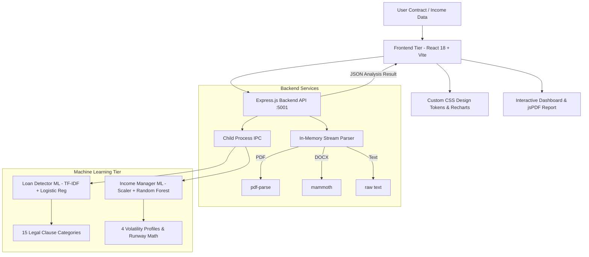

# Wealthra 🛡️

> **AI-Driven Digital Banking & Financial Distress Prevention**  
> _Democratizing Financial Health, De-risking Irregular Incomes, and Deciphering Predatory Loan Clauses with Machine Learning._

[](https://react.dev/)
[](https://expressjs.com/)
[](https://scikit-learn.org/)
[](https://developer.mozilla.org/en-US/docs/Web/CSS)
[](#universal-accessibility)
[](#hackathon-presentation--pitch-deck)

---

## 📌 Executive Summary

Over **70% of loan borrowers never read their 15–30 page loan agreements**, falling into predatory traps: 24–36% penal interest, 4–5% foreclosure charges, and hidden maintenance fees. Concurrently, **400M+ irregular earners** (freelancers, gig workers, small shop owners) suffer from the _“High-Income Month Trap”_—overspending during windfall months and plunging into insolvency during lean months.

**Wealthra** is a proactive, inclusive financial wellness ecosystem engineered to stop financial distress _before_ it happens.

---

## 🌟 Key Features

### 1. 🔍 Loan EMI Terms Detector (NLP / ML Clause Extraction)

- **Multi-Format Ingestion**: Upload loan contracts as **PDF**, Word **DOCX**, or paste raw text.
- **Trained NLP Classification**: Scikit-Learn `TfidfVectorizer` + `LogisticRegression` trained on **1,350 labeled legal clauses** across 15 standard banking categories (**100% test accuracy**).
- **10 Instant Financial Term Cards**:
  1. _Interest Rate_ (Floating vs. Fixed & benchmark MCLR spread)
  2. _EMI Amount_ & Debit Date
  3. _Loan Tenure_ & Amortization
  4. _Processing Fee_ (Upfront deduction)
  5. _Late Payment Penalty_ (Flagged in Red if penal rate >18% p.a.)
  6. _Foreclosure Charges_ (Lock-in period & pre-closure exit fees)
  7. _Prepayment Allowance_ (Part-payment conditions)
  8. _Mandatory Insurance_ (Credit-linked life/property policies)
  9. _Hidden Charges_ (Annual maintenance, documentation, statement fees)
  10. _Overall Risk Gauge_ (0–100 score + Green/Amber/Red safety rating)
- **Plain-English Translation**: Complex legalese is translated into simple language.
- **Client-Side PDF Export**: Generates and downloads a summary report via `jsPDF`.
- **Zero-Storage Privacy**: In-memory parsing via `pdf-parse` & `mammoth`—user contracts are never persisted to disk.

### 2. 📈 Monthly Income Manager (Volatility Smoothing Engine)

- **Designed for Irregular Earners**: Freelancers, gig workers, small merchants, daily earners, and seasonal businesses.
- **Machine Learning Volatility Profiling**: `StandardScaler` + `RandomForestClassifier` trained on **2,000 synthetic records** over 10 worker archetypes (**94.75% test accuracy**).
- **The Income Buffer Runway**: Calculates exactly how many months current liquid savings can cover essential living expenses (`savings / essential_expenses = X months`).
- **Dynamic Windfall Capping**: Prevents overspending during high-income spike months:
  - _Essential Living Expenses_: Capped to baseline (~45%)
  - _Emergency Buffer Reserve_: Boosted to 25% to build emergency runway
  - _Income Smoothing Fund_: Boosted to 15% to subsidize upcoming dry months
  - _Future Wealth Investments_: 10%
  - _Discretionary Flexible Spending_: Strictly capped to 5%
- **Financial Health Score (0–100)**: Multi-factor scoring with clear positive & warning drivers.
- **Interactive Visualizations**: Powered by `recharts` (Historical Trend Line Chart & Allocation Donut Chart).
- **Future Wealth Projections**: 3, 6, 12, 18, 24-month roadmap with goal progress tracking.

### 3. 🛡️ Distress Detection & Early Warnings

- Continuous monitoring of Debt-to-Income (DTI), debt service coverage, and liquid buffer days.
- Automated early warning flags before credit delinquency or cash flow dry spells occur.
- Prescriptive, non-predatory intervention workflows.

### 4. ♿ Universal Accessibility & Senior Inclusion

- **Simple Language Mode**: 1-click toggle replacing banking jargon with everyday vocabulary.
- **Voice Assistant**: Web Speech API audio guidance for visually impaired and elderly users.
- **High-Contrast CSS Tokens**: WCAG 2.1 AA compliant typography, button touch areas, and color contrasts.

---

## 🏗️ System Architecture



---

## 💻 Tech Stack

| Layer                | Technologies                                                                                |
| :------------------- | :------------------------------------------------------------------------------------------ |
| **Frontend**         | React 18, Vite 5, Pure Vanilla CSS (Bespoke Design Tokens), Lucide Icons, Recharts 2, jsPDF |
| **Backend**          | Node.js, Express.js, Multer (In-Memory Buffer), pdf-parse, mammoth, CORS                    |
| **Machine Learning** | Python 3, Scikit-Learn, Pandas, NumPy, Joblib, NLTK, StandardScaler, RandomForestClassifier |
| **Accessibility**    | Web Speech API, WCAG 2.1 AA Compliant Colors, Simple Language State Engine                  |

---

## 🚀 Quick Start & Installation

### Prerequisites

- **Node.js**: v18+ installed
- **Python**: v3.9+ installed
- **npm** or **yarn**

### 1. Clone & Install Dependencies

```bash
git clone https://github.com/shudeep2k6/Wealthra.git
cd Wealthra

# Install Frontend & Backend Node dependencies
npm install

# Install Python ML dependencies
pip install -r ml/requirements.txt
pip install -r ml/income_manager/requirements.txt
```

### 2. (Optional) Train / Verify the ML Models

Pre-trained models are already included in `/ml/` and `/ml/income_manager/`. To retrain from scratch:

```bash
# 1. Train Loan EMI Terms Detector Model
python ml/train_model.py

# 2. Train Monthly Income Manager Volatility Model
python ml/income_manager/generate_dataset.py
python ml/income_manager/train_model.py

# 3. Test Inference
python ml/income_manager/predict.py --test
```

### 3. Run the Full Application

```bash
# Run both Frontend (Vite) and Backend (Express) concurrently:
npm run dev:all
```

_Or run in separate terminals:_

```bash
# Terminal 1: Backend Server (Port 5001)
node server/server.js

# Terminal 2: Frontend Client (Port 3000 or 3001)
npm run dev
```

Open your browser at: **`http://localhost:3000`** (or **`http://localhost:3001`**).

---

## 🧪 Verified Test Scenario

Test the **Monthly Income Manager** with an extreme irregular freelancer scenario:

- **Income Pattern**: Jan: ₹5,000 | Feb: ₹30,000 (6x Windfall Peak) | Mar: ₹5,000 | Apr: ₹18,000 | May: ₹7,500
- **Expenses**: ₹8,000 / month (Essential: ₹6,000, Other: ₹2,000)
- **Savings**: ₹20,000 | **Investments**: ₹5,000 | **Loan EMI**: ₹2,000 | **Goal**: Emergency Fund (₹60,000)

**Output Verified**:

- **ML Classification**: `Highly Variable Income` (83.4% confidence)
- **Income Volatility**: `74.2%` (High Volatility alert)
- **Income Buffer**: `3.3 Months` (Guidance: build to 6.0 months)
- **Financial Health Score**: `50 / 100` (`Needs Improvement`)
- **Smart Allocation**: Directs 25% (₹1,880) to Emergency Buffer & 15% (₹1,120) to Smoothing Fund, capping discretionary spending to 5% (₹380) to neutralize the windfall trap.

---

## 📊 API Specification

### `POST /api/loan/analyze`

- **Content-Type**: `multipart/form-data` (file: `.pdf`, `.docx`, `.txt`) OR `application/json` (`{ "loanText": "..." }`)
- **Response**:
  ```json
  {
    "interest_rate": "10.5% floating p.a.",
    "emi_amount": "Rs. 12,450 per month",
    "loan_tenure": "60 months (5 years)",
    "processing_fee": "Rs. 3,500 non-refundable",
    "late_payment_penalty": "24% per annum on overdue amount",
    "foreclosure_charges": "4% + GST if closed within 24 months",
    "prepayment_terms": "Allowed up to 25% annually without penalty",
    "insurance_requirement": "Mandatory credit shield life policy",
    "hidden_charges": "Annual ledger maintenance fee of Rs. 1,200",
    "risk": "High",
    "risk_score": 75,
    "clauses": [ ... ],
    "simple_summary": "..."
  }
  ```

### `POST /api/income/analyze`

- **Content-Type**: `application/json`
- **Payload**:
  ```json
  {
    "monthly_income": [
      {
        "month": "January",
        "income": 5000,
        "essential_expenses": 6000,
        "other_expenses": 2000
      },
      {
        "month": "February",
        "income": 30000,
        "essential_expenses": 6000,
        "other_expenses": 2000
      }
    ],
    "expenses": 8000,
    "savings": 20000,
    "investments": 5000,
    "loan_emi": 2000,
    "financial_goal": "Emergency Fund",
    "goal_amount": 60000,
    "goal_months": 12
  }
  ```
- **Response**:
  ```json
  {
    "averageIncome": 13100,
    "highestIncome": 30000,
    "lowestIncome": 5000,
    "incomeVariability": 74.2,
    "predictedIncome": 12960,
    "financialHealthScore": 50,
    "riskLevel": "Needs Improvement",
    "incomeBuffer": 3.3,
    "mlProfile": { "category": "Highly Variable Income", "confidence": 83.4 },
    "allocation": { ... },
    "insights": [ ... ],
    "wealthPlan": { ... }
  }
  ```

---
